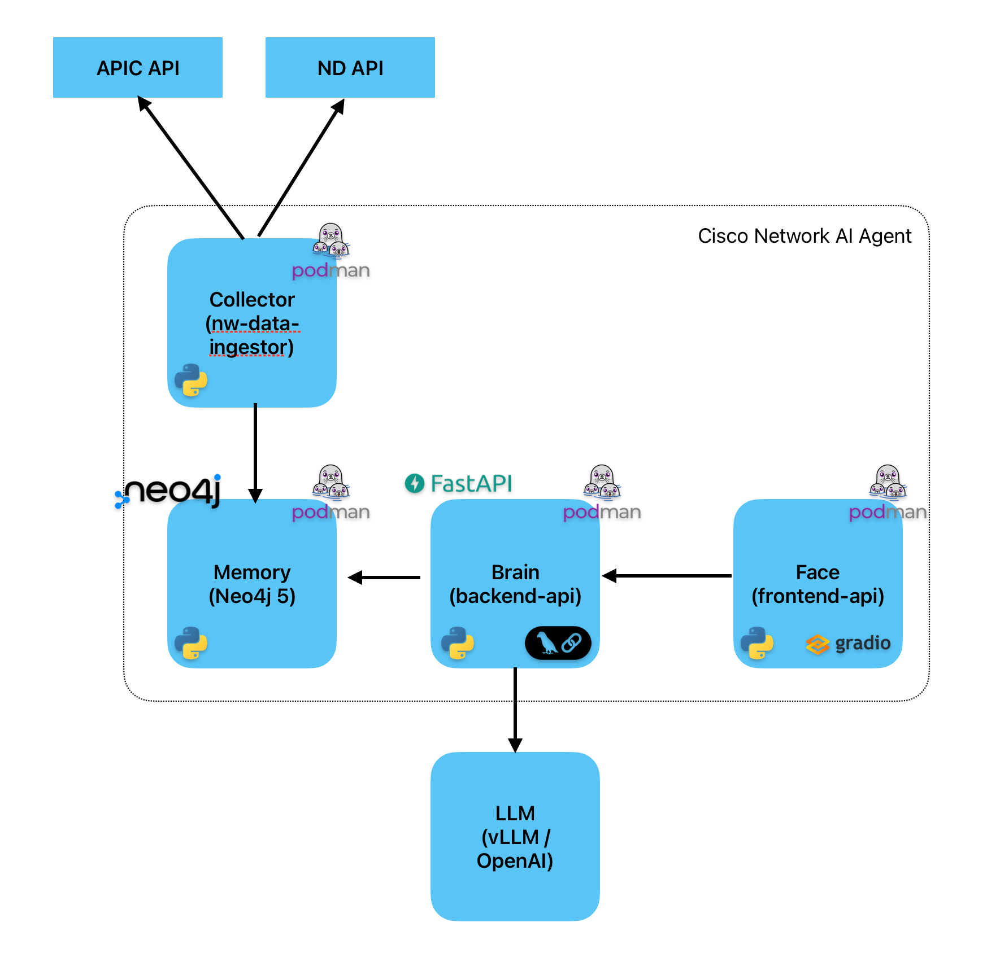

# Cisco Network AI Agent

A conversational AI agent for network operations that unifies data from **Cisco APIC**, **Cisco Nexus Dashboard (ND)**, and **Cisco Intersight** into a single Neo4j knowledge graph and answers natural-language questions over it.

Users interact through a Gradio web UI that combines a 3D topology graph (click any node to drill into it) with a chat panel. The agent routes each question to the right backend — Neo4j for topology and policy, the ND MCP server for live operational data, the Intersight MCP server for compute / server data — and synthesises a unified answer.

<p align="center">
  
</p>

Special thanks to three great Cisconians who made this possible: **Rob van der Kind, Jara Osterfeld, Olaf Barning**.

---

## Architecture

Eight cooperating components in the full OpenShift deployment:

| Component | Role | Tech |
|---|---|---|
| **frontend-app** | 3D topology + chat UI, node-click drill-down, dynamic suggestions, light/dark mode, MCP status badges | Gradio + custom JS + 3d-force-graph |
| **backend-api** | Question router, Cypher generator, MCP orchestration, answer synthesis | FastAPI + LangChain |
| **neo4j** | Unified knowledge graph (APIC + ND + Intersight) | Neo4j |
| **apic-ingestor** | Periodic sync of APIC, ND, and Intersight data into Neo4j; correlates UCS server vNICs to ACI endpoints by MAC | Python (`schedule` lib) |
| **nd-mcp-server** | MCP server fronting Nexus Dashboard for live ops queries (anomalies, advisories, fabric health) | Python MCP / HTTP |
| **nd-mcp-postgres** | Cluster credential storage for `nd-mcp-server` | Postgres |
| **nd-mcp-webui** | Admin UI for the ND MCP (cluster config, audit log, RBAC) | FastAPI |
| **intersight-mcp** | MCP server fronting Cisco Intersight API for compute/server data (66 read-only tools) | Node.js |

### How a question flows

1. User asks a question (typed, suggested, or via 3D node click).
2. `backend-api` classifies the question: **neo4j** (topology, policy, historical), **mcp** (live ND), **intersight** (compute), or **hybrid**. Quoted entities are looked up in Neo4j first so a question about `'C225-WZP29249VV2'` routes to Intersight even without explicit keywords.
3. For Neo4j paths: an LLM generates Cypher from the schema description and runs it.
4. For MCP paths: the right tool is picked, the query is executed, results are post-filtered (the Intersight MCP ignores OData `filter` so we trim results in Python), and the response is enriched with correlated Neo4j data when relevant.
5. An LLM synthesises the final answer using a domain-aware prompt (Cisco terms, not AWS — "VPC" = Virtual Port Channel, "Tenant" = ACI tenant).
6. A separate suggestion prompt generates three context-aware follow-up questions.

### Graph schema (key node types and relationships)

```
Fabric ─[:HAS_ANOMALY]→ Anomaly ─[:AFFECTS]→ Tenant
Fabric ─[:HAS_ADVISORY]→ Advisory
Tenant ─[:HAS_AP]→ AppProfile ─[:HAS_EPG]→ EPG
Tenant ─[:HAS_VRF]→ VRF
Tenant ─[:HAS_BD]→ BridgeDomain ─[:HAS_SUBNET]→ Subnet
Node   ─[:BELONGS_TO]→ Fabric
Node   ─[:HAS_FAULT]→ Fault
IntersightServer ─[:CONNECTED_TO]→ Endpoint ─[:MEMBER_OF]→ EPG
```

The `IntersightServer → Endpoint` correlation is created by the ingestor: each UCS vNIC's MAC is matched against the ACI endpoint table. This is how the agent answers things like *"which tenant is server X attached to"* — it walks `IntersightServer → Endpoint → EPG → AppProfile → Tenant`.

---

## Features

- **Three data sources, one graph**: APIC policy model, ND operational state, and Intersight compute data are stitched together and refreshed by a single scheduled ingestor.
- **3D topology map**: every node is clickable. Anomalies and Faults use their UUID so a click drills into the specific instance (not all anomalies that share a name).
- **Conversational, multi-turn**: chat history is threaded into the router; follow-ups like "What about its EPGs?" resolve to the server discussed in previous turns.
- **Dynamic suggestions**: every answer generates three follow-up suggestions tailored to the answer (Intersight-aware for server topics, schema-aware for anomalies, drill-down focused for graph clicks).
- **Live MCP status**: badges in the header show the real status of both MCPs — the ND badge probes a real ND login (not just the MCP service `/health`) and reports auth failures honestly.
- **Domain-aware synthesis**: prompts force Cisco terminology and steer the LLM away from cloud-provider hallucinations (e.g. "VPC" = Virtual Port Channel, remediation references APIC / NX-OS / Nexus Dashboard).
- **Graceful degradation**: any component can be unavailable. Without ND, live queries fail with a clear message and APIC/Intersight still work. Without Intersight, compute questions return a "not enabled" stub and the rest works.
- **Pluggable LLM**: backend supports either OpenAI or a local vLLM-compatible endpoint (Mistral Nemo 12B is the default Cisco-approved choice).
- **Observability**: optional Splunk OpenTelemetry tracing (traces every Neo4j query, MCP call, LLM call) when `SPLUNK_OBSERVABILITY_ENABLED=true`.
- **AI Defense**: optional Cisco AI Defense pre/post inspection of prompts and responses (`AI_DEFENSE_ENABLED=true`).

---

## Project Structure

```
.
├── backend/                       # backend-api source
│   ├── backend.py
│   ├── Containerfile
│   └── requirements.txt
├── frontend/                      # frontend-app source
│   ├── frontend.py
│   ├── Containerfile
│   └── requirements.txt
├── ingestor/                      # apic-ingestor source
│   ├── ingest_nw_data.py
│   ├── Containerfile
│   └── requirements.txt
├── intersight-mcp-deployment/     # local Intersight MCP build context
├── openshift/                     # OpenShift manifests
│   ├── backend-buildconfig.yaml
│   ├── frontend-buildconfig.yaml
│   ├── ingestor-buildconfig.yaml
│   ├── nd-mcp-server.yaml
│   ├── nd-mcp-webui.yaml
│   ├── nd-mcp-buildconfig.yaml
│   └── intersight-mcp/
│       └── deployment.yaml
├── neo4j/                         # Neo4j persistent volumes (local)
├── scripts/                       # helper scripts
├── podman-compose.yml             # local 4-container compose
├── .env                           # local-dev credentials (ignored by git)
├── architecture.png
├── INTERSIGHT_INTEGRATION_ASSESSMENT.md
├── nd_integration.md
└── README.md
```

---

## Deployment

There are two supported deployment paths:

### A. Local development — `podman-compose`

Brings up four containers: `neo4j`, `apic-ingestor`, `backend-api`, `frontend-app`. **Does not** include the MCP servers — for local dev the agent works against APIC + ND data ingested into Neo4j only. Compute/server questions will return a "not enabled" stub.

```bash
cp .env.example .env       # or edit .env directly
# Fill in APIC / ND / OpenAI (or local LLM) credentials in .env
podman-compose up -d --build
# UI on http://localhost:7860
```

### B. Full deployment — OpenShift

Brings up all eight components. Builds are driven by `BuildConfig` resources in `openshift/`; secrets and credentials live in OpenShift `Secret` objects.

#### Secrets

| Secret | Keys | Consumer |
|---|---|---|
| `gbaia-secrets` | `openai-api-key`, `neo4j-password`, `nd-url`, `nd-user`, `nd-password`, `local-llm-token`, `splunk-access-token`, `ai-defense-api-key`, `model-proxy-api-key` | backend, ingestor |
| `nd-mcp-secrets` | `ND_URL`, `ND_USER`, `ND_PASSWORD`, `MCP_API_TOKEN`, `ENCRYPTION_KEY`, `POSTGRES_*` | nd-mcp-server, nd-mcp-postgres |
| `intersight-secrets` | `api-key-id`, `private-key` (PEM mounted as file), `base-url`, `account` | intersight-mcp, ingestor |

#### Deploy

```bash
oc apply -f openshift/                       # apply manifests
oc start-build gbaia-backend  -n gbaia       # build images
oc start-build gbaia-frontend -n gbaia
oc start-build gbaia-ingestor -n gbaia
oc rollout status deployment backend-api -n gbaia
```

Image streams are wired to the deployments; restarting a deployment picks up the latest build.

#### Credential rotation note

The ND MCP server stores its cluster credentials in postgres and uses that at runtime — it does **not** read `NEXUS_PASSWORD` from env after first deploy. To rotate the ND password, hit the MCP's own API:

```bash
oc -n gbaia exec deploy/backend-api -- python3 -c "
import httpx, os
httpx.put('https://nd-mcp-server-gbaia.<route-domain>/api/clusters/default',
    json={'password': os.environ['NEW_PW']}, timeout=15, verify=False)
" NEW_PW="$NEW_PW"
oc patch secret gbaia-secrets -n gbaia --type=merge \
    -p="{\"stringData\":{\"nd-password\":\"$NEW_PW\"}}"
oc rollout restart deployment apic-ingestor -n gbaia
```

---

## Configuration reference

### Backend environment

| Variable | Purpose | Default |
|---|---|---|
| `NEO4J_URI` / `NEO4J_USER` / `NEO4J_PASSWORD` | Neo4j connection | `bolt://neo4j:7687` / `neo4j` / *(secret)* |
| `OPENAI_API_KEY` | OpenAI API key — required when no local LLM is set | – |
| `LOCAL_LLM_URL` | URL of a vLLM-compatible endpoint. If set, used instead of OpenAI | – |
| `LOCAL_LLM_TOKEN` | Bearer token for the local LLM | – |
| `MCP_ENABLED` / `MCP_SERVER_URL` / `MCP_TOKEN` | ND MCP enable + URL + bearer token | `false` / – / – |
| `INTERSIGHT_MCP_ENABLED` / `INTERSIGHT_MCP_URL` | Intersight MCP enable + URL | `true` / `http://intersight-mcp:3000` |
| `SPLUNK_OBSERVABILITY_ENABLED` | Enable OpenTelemetry tracing | `false` |
| `OTEL_EXPORTER_OTLP_ENDPOINT` | OTel collector | – |
| `AI_DEFENSE_ENABLED` / `AI_DEFENSE_*` | Cisco AI Defense inspection | `false` |

### Ingestor environment

| Variable | Purpose |
|---|---|
| `APIC_URL`, `APIC_USER`, `APIC_PASSWORD` | APIC connection |
| `ND_URL`, `ND_USER`, `ND_PASSWORD` | Nexus Dashboard connection |
| `INTERSIGHT_API_KEY_ID` | Intersight API key (format `accountMoid/userMoid/keyMoid`) |
| `INTERSIGHT_API_SECRET_KEY` | PEM private-key content OR path to file |
| `INTERSIGHT_BASE_URL` | Intersight tenant URL (default `https://intersight.com`) |
| `APIC_FABRIC_NAME` | Optional: pin APIC objects to a specific ND fabric |

### `.env` file format

The local `.env` (used by `podman-compose` and standalone runs) follows the same names as the env vars above. **The `.env` variables for Intersight are `INTERSIGHT_API_KEY_ID` and `INTERSIGHT_API_SECRET_KEY`** — earlier draft scripts referenced `INTERSIGHT_APIKEY` / `INTERSIGHT_SECRETKEY`, which the code does not read.

---

## How to use

1. Open the UI (`http://localhost:7860` for podman, the OpenShift route for the full deployment).
2. The 3D map shows the current state of the graph. Use the legend to filter; left-click any node to ask about it.
3. Type a question, hit a suggestion chip, or click a node — the answer streams into the chat panel.

### Example questions

**Topology / policy (Neo4j):**
- *"List all fabrics"*
- *"What tenants belong to the `ams-aci` fabric?"*
- *"Show all EPGs in tenant `infraservices`"*

**Live operations (ND MCP):**
- *"What is the current health of fabric `ams-aci`?"*
- *"Show me the active anomalies"*

**Specific anomaly (drill-in):**
- click any anomaly node on the 3D map → *"Tell me about this specific anomaly with uuid `VPC113543349616`. Use the details and fabric fields…"*

**Compute / servers (Intersight MCP):**
- *"Tell me about `'C225-WZP29249VV2'`"*
- *"What is the firmware version on `'C225-WZP29249VV2'`?"*
- *"What are the network adapter details for `'C225-WZP29249VV2'`?"* — returns Intersight inventory **plus** EPG/AppProfile/Tenant chain from the Neo4j enrichment

---

## Known limitations

- **Intersight MCP 1.0.16 bugs**: `get_server_details`, `get_server_profile`, and `get_server_telemetry` always fail with `404 'undefined'`; the OData `filter` argument is ignored on `list_*` tools. The backend works around both by globally excluding the broken GETs and post-filtering list results in Python. As a side effect, *live* CPU%/memory%/temperature aren't available — the inventory record is. The backend tells the user explicitly and points them at the Intersight UI for real-time graphs.
- **ND `advisories` legacy path is gone**: the ingestor uses `/api/v1/analyze/advisories/details?fabricName=X`. The older `/api/v1/advisories` returns 404 on current ND versions.
- **Local podman setup has no MCPs**: live ND queries and Intersight queries only work in the full OpenShift deployment.

---

## Files of interest

| File | What's in it |
|---|---|
| `backend/backend.py` | Question routing, Cypher prompt + schema description, MCP orchestration, answer synthesis, suggestion generation |
| `frontend/frontend.py` | 3D graph rendering, node-click handlers, MCP badges, chat panel, light/dark theme |
| `ingestor/ingest_nw_data.py` | APIC + ND + Intersight sync, MAC-based vNIC↔Endpoint correlation, schedule loop |
| `openshift/` | All BuildConfig and Deployment manifests for the cluster install |
| `INTERSIGHT_INTEGRATION_ASSESSMENT.md` | Deeper write-up of the Intersight integration |
| `nd_integration.md` | Notes on the Nexus Dashboard integration |
